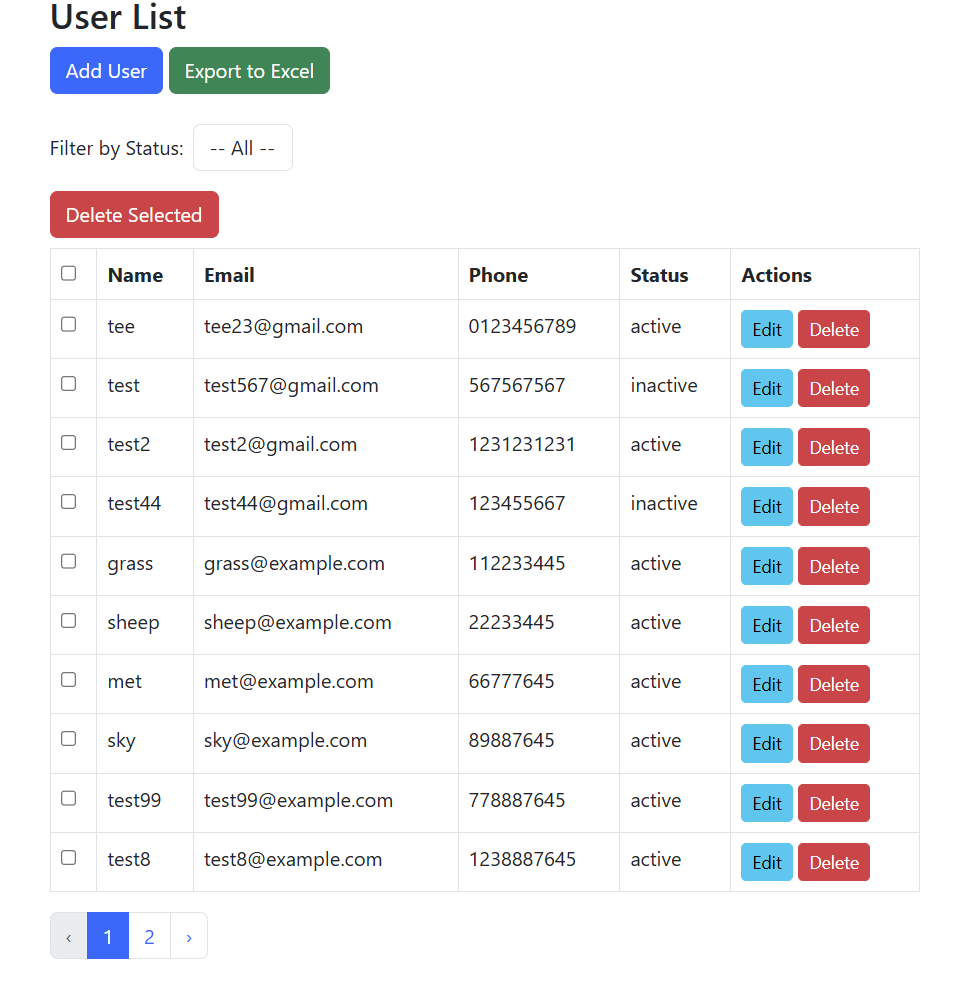
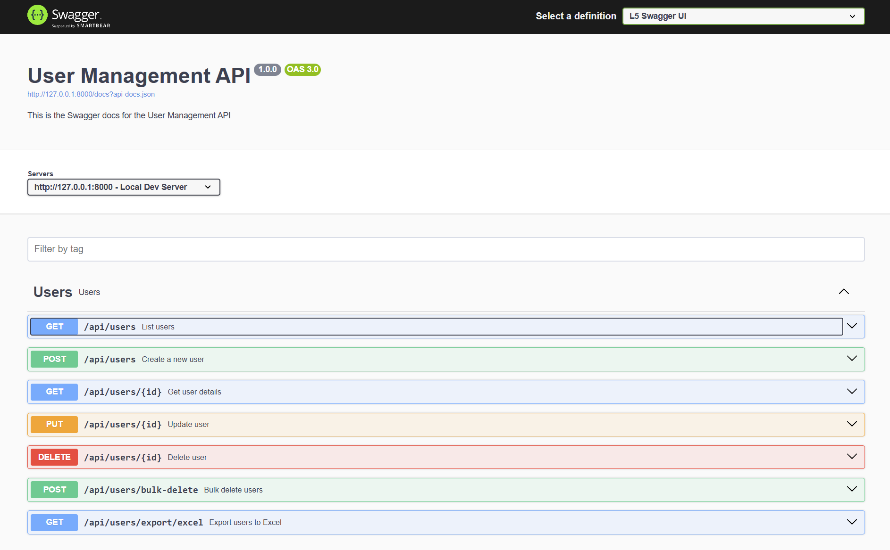
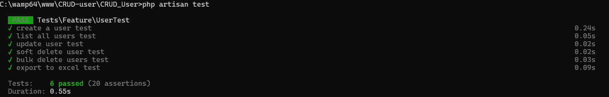

# 1. Clone the repository
git clone https://github.com/TeeSyong/CRUD-User.git
cd your-laravel-project

# 2. Install PHP dependencies
composer install

# 3. Copy .env
cp .env.example .env

# 4. Generate application key
php artisan key:generate

# 5. (Optional but recommended) Set DB credentials in .env
# DB_DATABASE=your-db-name
# DB_USERNAME=root
# DB_PASSWORD=
# Create a mysql database named " user-CRUD" 
# or can change the .env file to suit yourself

# 6. Run database migrations
php artisan migrate

# 7. Run the project
php artisan serve
then head http://127.0.0.1:8000/admin/users basically need add /admin/users

# 8. To test the RESTful API endpoint i used swagger since mentioned in task
just head to http://127.0.0.1:8000/api/documentation# when you running your php artisan serve then you can access

# 9. Lastly to carry out unit test 
php artisan test

# Not sure if the way i understand the task is what you guys expected ,so basically i just create both route api and web, and both controller, for web and for api , 1 uses for the frontend web , and another one used soley for the Restful Api to call , below are some sample image of the result.

